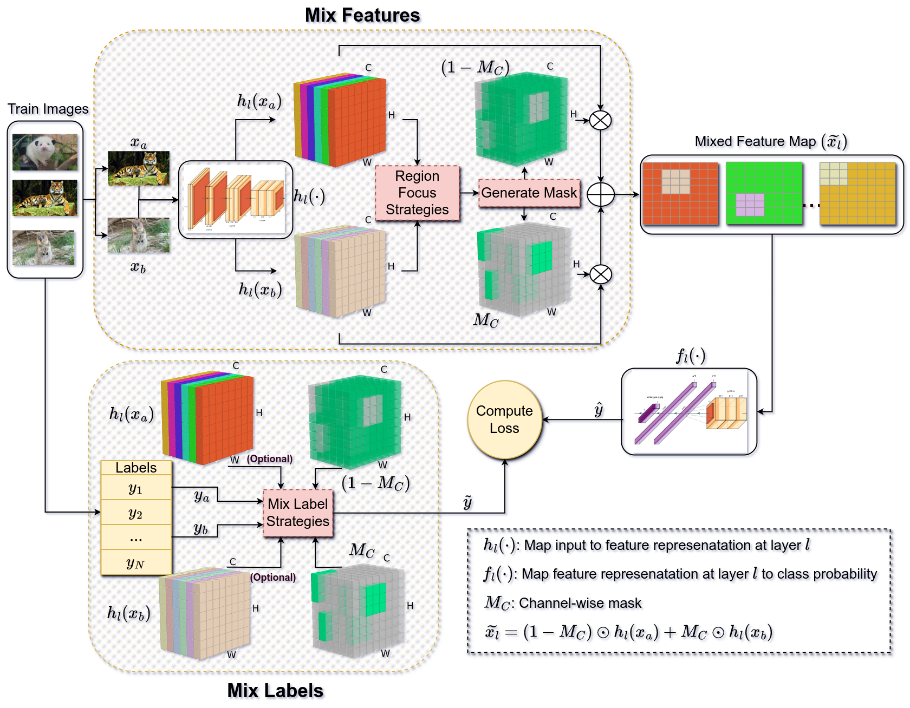
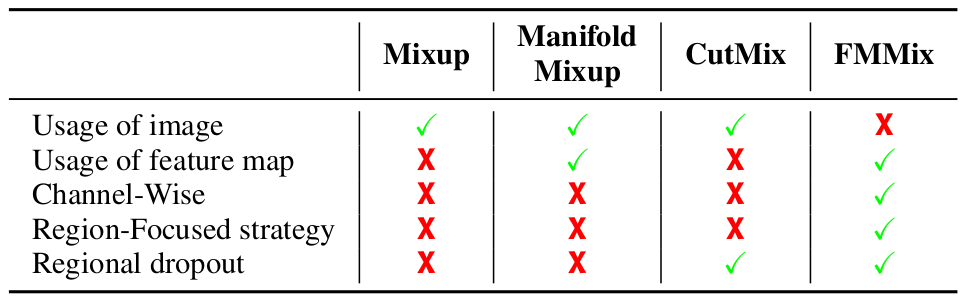
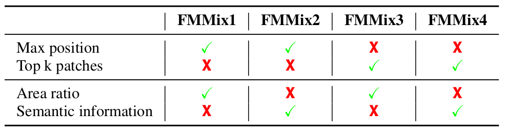

# FMMix: A Novel Augmentation Strategy for Enhancing Feature Diversity to Boost Model Generalization
[](https://pytorch.org/)


This repository is the official implementation of [FMMix: A Novel Augmentation Strategy for Enhancing Feature Diversity to Boost Model Generalization](). 

Khoa Tho Anh Nguyen, Ngoc Hong Tran, Vinh Quang Dinh



### Abstract 
Data augmentation, pivotal for enhancing model performance and generalization, has seen significant advancements with mixed-sample techniques that blend elements from multiple training instances. Despite their success, these methods face challenges like generating unrealistic samples and potential performance degradation with excessive use. Our study explores the application of traditional mixed-sample augmentations at the feature level within Convolutional Neural Networks (CNNs), acknowledging existing limitations and untapped potential. This exploration aims to understand how such an approach might enhance generalization by encouraging the model to learn more abstract representations. Drawing on insights from this investigation, we propose FFMix, a collection of four innovative feature-level augmentation methods. These methods introduce region-focused strategies and sophisticated label mixing ratios, informed by area and semantic information, to ensure coherent augmentation. Our extensive analysis of CIFAR-100 and Tiny ImageNet datasets reveals that feature-level augmentations yield an improvement of 5.43% and 6.73% over the baseline, surpassing conventional input-level augmentations like Mixup (by 2.52% and 4.35%) and CutMix (by 1.83% and 2.88%). Additionally, our research delves into combining FFMix with classic methods like Mixup and CutMix. When FFMix is integrated with established methods such as Mixup, we observe an additional enhancement of 2.91% and 4.46% over Mixup alone.

### Comparison among Mixup, Manifold Mixup, CutMix, and FMMix.
FMMix represents an innovative approach that builds on
established methods, inheriting the best features of three distinct
techniques: it combines sample and label mixing from Mixup, adopts
feature-level only from Manifold Mixup, and leverages regional dropout
effect with the cut-paste method from CutMix. Moreover, FMMix
improves performance by employing channel-wise and region-focused
strategies to maximize the extraction of crucial features.



### Comparison of FMMix variants.
The table outlines the combinations of our proposed feature map and label mixing methods employed by four FMMix methods.



## Checklist
- [x] Results Table 
- [x] Checkpoint
- [x] Dataset Preparation
- [x] Training Code
- [x] Evaluation Code
- [x] Comprehensive User Guide

## Contents

1. [Results - Checkpoints and Test](#results---checkpoints-and-test)
2. [Installation Instructions](#installation-instructions)
3. [Dataset Preparation](#dataset-preparation)
4. [Training](#training)
5. [Evaluation](#evaluation)
6. [Citation](#citation)

## Results - Checkpoints and Test
**Table 1 (in our paper):** Performance comparison of Mixup and CutMix techniques across various layers on CIFAR-100. The highest accuracies are highlighted in bold, and entries in green indicate an enhancement over the baseline accuracy of 74.57%. * denotes the input level augmentation.

| Layer     | Mixup   | CutMix     | 
|-----------------------|------------|------------|
| [0]*      | 77.48 (+2.91)  <br> [Download](https://drive.google.com/drive/folders/1bTwUhXHr2GBfSGXJDvLi9GkBDH-4RurC?usp=drive_link)       | 78.17 (+3.60) <br> [Download](https://drive.google.com/drive/folders/1jf1-UF-iJadcsUbcnUkkLCTpKhhbdLv1?usp=drive_link)     |
| [1]     | 77.99 (+3.42) <br> [Download](https://drive.google.com/drive/folders/1LP5sFD5jZrWueriLpO4uW-bpux4hLH5q?usp=drive_link)   | 79.20 (+4.63) <br> [Download](https://drive.google.com/drive/folders/1bn7AvYytGpUGS4OBKwG6k8Mou70GtDFj?usp=drive_link)      | 
| [2] | 78.10 (+3.53)  <br> [Download](https://drive.google.com/drive/folders/1q23oQJQg8SsYfspMDVovdGCtVBvjAOnt?usp=drive_link)    | 78.17 (+3.60) <br> [Download](https://drive.google.com/drive/folders/1ep0OsphVCe4bU7AgyXiIgFZBgWfoIE4h?usp=drive_link)      |
| [3]  | 76.20 (+1.63)  <br> [Download](https://drive.google.com/drive/folders/1zZpU5VMdTRbrDOEsjCyguUfB9dw9cwi2?usp=drive_link)     | 76.84 (+2.27)  <br> [Download](https://drive.google.com/drive/folders/1WtyhZSaCKyUKZJ7w1ekSASZ3BRW0IrQC?usp=drive_link)    |
| [4]  | 77.11 (+2.54) <br> [Download](https://drive.google.com/drive/folders/1bxepqUqK_u9t0vKRO1Gc99n8Yhcwbmbm?usp=drive_link)     | 77.16 (+2.59)  <br> [Download](https://drive.google.com/drive/folders/1qXBGIK0eb4NvH_xKVtkIjybuWfSXl5HL?usp=drive_link)     | 

**Table 2 (in our paper):** Performance comparison of Mixup and CutMix techniques across various combinations of hidden layers on CIFAR-100. The highest accuracies are highlighted in bold, and entries in green indicate an enhancement over the baseline accuracy of 74.57%. augmentation.

| Layer     | Mixup   | CutMix     |     
|-----------------------|------------|------------|
| [1, 2]      | 78.45 (+3.88) <br> [Download](https://drive.google.com/drive/folders/1TGB5-XLOMarmHMX0M5Ant-CN4VONa4At?usp=drive_link)      | 79.02 (+4.45) <br> [Download](https://drive.google.com/drive/folders/1YA-svuPnPBML7dM9nQgSZ3BGeBEo_7KP?usp=drive_link)     | 
| [2, 3]     | 78.35 (+3.78) <br> [Download](https://drive.google.com/drive/folders/1KrrFs0a6WnKGgwG3VykswwRUcA4TqmxH?usp=drive_link)      | 78.10 (+3.53) <br> [Download](https://drive.google.com/drive/folders/1m_49GhCy3PlPgtBhC-0V4NaQ8eWLBWIH?usp=drive_link)      | 
| [3, 4] | 77.90 (+3.33) <br> [Download](https://drive.google.com/drive/folders/1Jm4ZZrdURFyUUwn2ayVSOm29bFoqxl5V?usp=drive_link)      | 77.60 (+3.03) <br> [Download](https://drive.google.com/drive/folders/1fBaM_pbos8eU9uImOmbqr53vP-gsFEk1?usp=drive_link)      | 
| [1, 2, 3]  | 76.11 (+1.54) <br> [Download](https://drive.google.com/drive/folders/1gPViuJ6LTLW7Qt3GYdFIj-yiwk3_2RP1?usp=drive_link)      | 79.19 (+4.62) <br> [Download](https://drive.google.com/drive/folders/1szK9_uRZk2oGHzfEEFbz3PSkXSr39TYD?usp=drive_link)     |
| [2, 3, 4]  | Fail       | 78.38 (+3.81) <br> [Download](https://drive.google.com/drive/folders/111xMV_fRHIDnQogTNg5S3arp1EQbpwE8?usp=drive_link)      | 
| [1, 2, 3, 4]  | 79.00 (+4.43) <br> [Download](https://drive.google.com/drive/folders/1Ghn_X4CNwWZldR6QGMJ3Bd_tTAHPL_Qq?usp=drive_link)      | 79.40 (+4.83) <br> [Download](https://drive.google.com/drive/folders/1zpLRDwDoTLHY_FfEz35XJCZmss1y70aI?usp=drive_link)      | 

**D Table 5 (in our paper):** Performance comparison of the four proposed FMMix techniques across various hidden layers on CIFAR-100. The highest accuracies are highlighted in bold, and entries in green indicate an enhancement over the baseline accuracy of 74.57%.

| Layer     | FMMix1   | FMMix2     |  FMMix3   | FMMix4| |
|-----------------------|------------|------------|----|------------|------------|
| [1]     | 79.48 (+4.91)    <br> [Download](https://drive.google.com/drive/folders/1GPUtvdkKBVEhCyGCOp99FOA02UmA2blR?usp=drive_link)  | 78.85 (+4.28)       <br> [Download](https://drive.google.com/drive/folders/1h0yHozoTiWkr5z8S_AV3ea-ebhhpDzgM?usp=drive_link)  | 78.92 (+4.35) <br> [Download](https://drive.google.com/drive/folders/1QOxz_9MDwuKeTkQzorpkleOIVbu_wOll?usp=drive_link)  | 78.68 (+4.11) <br> [Download](https://drive.google.com/drive/folders/1MeQdwHIsJ3qplrsVjHlZEurgCwJFZsa_?usp=drive_link)  |
| [2] | 78.06 (+3.49)      <br> [Download](https://drive.google.com/drive/folders/1o3EP3TWri4-3wCpQCcGVb3BeO-COztxY?usp=drive_link)  |  78.45 (+3.88)      <br> [Download](https://drive.google.com/drive/folders/1UzwNUNk_jWpLlEDitXgJ6V_V_xuKHvHR?usp=drive_link)  | 78.32 (+3.75) <br> [Download](https://drive.google.com/drive/folders/1Y2Cn_ja3yoidDPWUQ9fnpUkS9jlvuABp?usp=drive_link)  | 78.79 (+4.22) <br> [Download](https://drive.google.com/drive/folders/19j7IDUrLO7FmOhSHqinTfBT5DQkQCJzx?usp=drive_link)  |
| [3] | 76.31 (+1.74)       <br> [Download](https://drive.google.com/drive/folders/1HxnaQDWEtYt_xh32vlhZGz6N-By9BKoI?usp=drive_link)  |  Fail      | 75.52 (+0.95) <br> [Download](https://drive.google.com/drive/folders/1o_dbuLhn-eL1Mk1Xi0Xi6Uim0qPaoDVG?usp=drive_link)  | 75.90 (+1.33) <br> [Download](https://drive.google.com/drive/folders/1FmKfKlpptZQU7GSZC06P-rREjV-odBvE?usp=drive_link)  |
| [4]  | 77.39 (+2.82)      <br> [Download](https://drive.google.com/drive/folders/1lTVPDMLsHL-8iXYs8BmY-AbCKxTnZUV2?usp=drive_link)  | 76.88 (+2.31)       <br> [Download](https://drive.google.com/drive/folders/1njUbRPu133nKS-F6mUwl4BslkQ3mfWr7?usp=drive_link)  | 76.97 (+2.40) <br> [Download](https://drive.google.com/drive/folders/1G3Y5tdlMk7NkvE_C5ADvuw16pBfoCMzk?usp=drive_link)  |  76.94 (+2.37) <br> [Download](https://drive.google.com/drive/folders/1ANBwX1UNcNV2qdJpX8YAd_Biirfzse1y?usp=drive_link)  |

**Table 6 (in our paper):** Performance comparison of the four proposed FMMix techniques across various combinations of hidden layers on CIFAR-100. The highest accuracies are highlighted in bold, and entries in green indicate an enhancement over the baseline accuracy of 74.57%.

| Layer     | FMMix1   | FMMix2     |  FMMix3   | FMMix4| |
|-----------------------|------------|------------|----|----|----|
| [1, 2]      | 79.73 (+5.16)       <br> [Download](https://drive.google.com/drive/folders/1sEHOpIgDfC2w1KDAS64bPCzoTqk4MZO1?usp=drive_link) | 79.51 (+4.94)     <br> [Download](https://drive.google.com/drive/folders/1MCvpYJA92oNPe_xYxcaqc3ScYROEjfbJ?usp=drive_link) | 79.07 (+4.50) <br> [Download](https://drive.google.com/drive/folders/19R93qbms9POty2eR2HyqBfImgvLrckdf?usp=drive_link) | 78.44 (+3.87) <br> [Download](https://drive.google.com/drive/folders/1OJAR3XVycx2Zm979RgmFaOuD8vj6ClN6?usp=drive_link) |
| [2, 3]     | 79.05 (+4.48)    <br> [Download](https://drive.google.com/drive/folders/1-eGl5ZWkj7Cr1-rJR82AzO1tlYyPXJCy?usp=drive_link) | 78.93 (+4.36)       <br> [Download](https://drive.google.com/drive/folders/1jDyIlUa0AfpgP1sW-uSrpkoLcrW0xZUw?usp=drive_link) | 79.08 (+4.51) <br> [Download](https://drive.google.com/drive/folders/1RUUT4rPKqtloA02JkeJ0dP82-4iPNHXU?usp=drive_link) | 78.69 (+4.12) <br> [Download](https://drive.google.com/drive/folders/1aLH6cPsACO9NZSDBwAF4Pai1vQT28jUW?usp=drive_link) |
| [3, 4] |  77.64 (+3.07)     <br> [Download](https://drive.google.com/drive/folders/15-izygUFHgIH7LDYvAHtXkbKLSxy90RI?usp=drive_link) | 77.52 (+2.95)        <br> [Download](https://drive.google.com/drive/folders/1YELDt2P4R9ShP4abgWM4spQOrESTKYQI?usp=drive_link) | 76.91 (+2.34) <br> [Download](https://drive.google.com/drive/folders/1WxqTLXcbKBrt9KAeJyzfynhZbEL22JpB?usp=drive_link) | 76.45 (+1.88) <br> [Download](https://drive.google.com/drive/folders/17ZItrwLn-8Lv6Qe2sHiEFs5vBm3ScalC?usp=drive_link) |
| [1, 2, 3]   | 79.74 (+5.17)       <br> [Download](https://drive.google.com/drive/folders/1UA6qV07hEwYFCeRglwUmOG6YoyrHUey6?usp=drive_link) | 79.47 (+4.90)      <br> [Download](https://drive.google.com/drive/folders/1aWQvYJE4lQG8Q6phMbJKE1F4UVDeljuL?usp=drive_link) | 80.04 (+5.47) <br> [Download](https://drive.google.com/drive/folders/1s4hiqsO1mHxI-E7Ub76l6i1tISzh6mn0?usp=drive_link) | 79.24 (+4.67) <br> [Download](https://drive.google.com/drive/folders/1ITXA_83KSs8AtAz-XSO24sXwHhRW1E0r?usp=drive_link) |
| [2, 3, 4] |  79.36 (+4.79)     <br> [Download](https://drive.google.com/drive/folders/1p1NVIXp3m2bckl1uuBkPqBHLyhZSJeR7?usp=drive_link) | 79.66 (+5.09)       <br> [Download](https://drive.google.com/drive/folders/1bpMB3l5-eIC-6isJHYxRcDrfQgEX8qo9?usp=drive_link) | 79.27 (+4.70) <br> [Download](https://drive.google.com/drive/folders/1plWsKbpwkxvJK9gAL5tWUh52c3J8nDP-?usp=drive_link) | 79.56 (+4.99) <br> [Download](https://drive.google.com/drive/folders/1hddbiWcP5rLroaButu31njdjWb8SQwYB?usp=drive_link) |
| [1, 2, 3, 4]  |  80.00 (+5.43)     <br> [Download](https://drive.google.com/drive/folders/10xhYQqLywVIwwrGXS8gyqShUdB3euKvb?usp=drive_link) | 79.88 (+5.31)       <br> [Download](https://drive.google.com/drive/folders/11Gb28xWztPtfUptGjc37lSzrvVPUlg1g?usp=drive_link) | 79.70 (+5.13) <br> [Download](https://drive.google.com/drive/folders/1Efm0swsgsZXinCZ-8YFCAo9CMJCmrqe_?usp=drive_link) | 79.74 (+5.17) <br> [Download](https://drive.google.com/drive/folders/12Jh9m-GhceiJgzTjOzbvAyQfaQzR7SzZ?usp=drive_link) |


**Table 7 (in our paper):** Test Accuracy Comparison of Mixup, Manifold, CutMix, and FMMix1 on CIFAR-100 and TinyImageNet Datasets. Entries in bold represent the highest accuracy achieved for each method. Green highlights denote improvements in accuracy, while red highlights signify decreases, all in comparison to the baseline accuracy of 74.57%.

| Layer     | CIFAR100   | TINY200     |     |
|-----------------------|------------|------------|----|
| Baseline      | 74.57 (0.00)      <br> [Download](https://drive.google.com/drive/folders/1eKjQq5g7AsQCNE0_dhtjb_2K2EHVx3E7?usp=drive_link) | 58.46 (0.00)      <br> [Download](https://drive.google.com/drive/folders/1zChwzvoExiTBk06udibe1TE_BIP40gDB?usp=drive_link) |
| Mixup   | 77.48 (+2.91)      <br> [Download](https://drive.google.com/drive/folders/1D0fwSMyXuo1YIbwULDEk_1tDIGYGtOAi?usp=drive_link) | 60.84 (+2.38)     <br> [Download](https://drive.google.com/drive/folders/1ebSnyQ2xllb3ZPELDdAIKLSI1ARfl-sM?usp=drive_link) |
| *Manifold Mixup_[0, 1, 2] | 76.86 (+2.29)      <br> [Download](https://drive.google.com/drive/folders/1EQLdHd-6dIfU9Nd2_C1fhjIByNLevUX_?usp=drive_link) | 54.43 (-4.03)      <br> [Download](https://drive.google.com/drive/folders/19BbdMUsCV1jKVzVS-4X0Twezd2n-7hRf?usp=drive_link) |
| Manifold Mixup_[0, 1, 2, 3] | 76.93 (+2.36)      <br> [Download](https://drive.google.com/drive/folders/1IN3zGnTuyZbfqJsNRej9lXTzKU86zzLV?usp=drive_link) | 54.53 (-3.93)      <br> [Download](https://drive.google.com/drive/folders/1sU96X4QDtHow6FBP_64TmZ678uvCaxm8?usp=drive_link) |
| Manifold Mixup_[0, 1, 2, 3, 4] | 77.09 (+2.52)    <br> [Download](https://drive.google.com/drive/folders/1vH06n6fdf3Rp5nvWIkx2E8LsQVn4EpcD?usp=drive_link) | 54.16 (-4.30)      <br> [Download](https://drive.google.com/drive/folders/1r1RL1kckcEBkQVmw2vOpI5b2TzDPeYN8?usp=drive_link) |
| CutMix | 78.17 (+3.60)      <br> [Download](https://drive.google.com/drive/folders/10j3St78vuzmA6yfC06nNVZaRvcAZSDlL?usp=drive_link) | 62.31 (+3.85)      <br> [Download](https://drive.google.com/drive/folders/1Pv7ARGKz-ejpewLOHQ4uF75elOYeVSMF?usp=drive_link) |
|FMMix1_[1] | 79.48 (+4.91)      <br> [Download](https://drive.google.com/drive/folders/1GTBjc1GmTSU_vxLgZ9T9c-bA7odKL82k?usp=drive_link) | 61.89 (+3.43)      <br> [Download](https://drive.google.com/drive/folders/1oa7RRq0JeKytq-QgODeGIFq2xe48RnkI?usp=drive_link) |
| FMMix1_[1, 2]  | 79.73 (+5.16)     <br> [Download](https://drive.google.com/drive/folders/1wPJ3Maqk96OfXoNTrMPVkHaMKDWJwWFg?usp=drive_link) | 62.42 (+3.96)      <br> [Download](https://drive.google.com/drive/folders/1GDJTbJ20qBHTkkvMGA0v0bDlruYqvmRZ?usp=drive_link) |
| FMMix1_[1, 2, 3]  | 79.74 (+5.17)     <br> [Download](https://drive.google.com/drive/folders/1LyTZhc-k5iSs7Tn8hbnBEztVvFQcTHqw?usp=drive_link) | 64.60 (+6.14)      <br> [Download](https://drive.google.com/drive/folders/1XuxlkQllf5qom34tppzEzA3B_72v12D2?usp=drive_link) |
| FMMix1  | 80.00 (+5.43)      <br> [Download](https://drive.google.com/drive/folders/1bkP5V59M2hsHaTDkur6YdWUIimxosYYH?usp=drive_link) | 65.19 (+6.73)      <br> [Download](https://drive.google.com/drive/folders/1RjRFebTOQQDzEtyckLdmRURCcqd-OWuK?usp=drive_link) |
| Mixup + FMMix1  | 80.39 (+5.82)      <br> [Download](https://drive.google.com/drive/folders/1OPYtNDwlp9JJfB5GzMOQD8fIa9D4M2P7?usp=drive_link) | 65.30 (+6.84)      <br> [Download](https://drive.google.com/drive/folders/1hGjWMKDrguUb1F51sGdqve_-5YTyBMMe?usp=drive_link) |
| CutMix + FMMix1  | 79.74 (+5.17)     <br> [Download](https://drive.google.com/drive/folders/1IJ9d_SW96Ja2qdmzFbbviW8svUgKsn8G?usp=drive_link) | 65.14 (+6.68)      <br> [Download](https://drive.google.com/drive/folders/1KkudHI2o5gokFd4xRA2_mQRZwz_CGM6y?usp=drive_link) |


<!-- | Layer     | Mixup   | CutMix     |     |
|-----------------------|------------|------------|----|
| [0]*      | 26.0       | 25.2       | [Download]() |
| [1]     | 18.8       | 18.4       | [Download]() |
| [2] | 17.1       | 16.0       | [Download]() |
| [3]  | 14.0       | 12.2       | [Download]() |
| [4]  | 14.0       | 12.2       | [Download]() | -->

## Installation Instructions

We conducted experiments under
- python 3.11.5
- pytorch 2.1.1 torchvision 0.16.1 cu11.8

To install requirements:

```setup
pip install -r requirements.txt
```

## Dataset Preparation
We experiment on three major benchmark dataset: CIFAR-100 .

### CIFAR100
When using the CIFAR-100 train command in the Training section, the dataset will automatically download to the specified directory `FMMix/data`.

### Tiny-Imagenet-200
The following process is modified from [link](https://github.com/vikasverma1077/manifold_mixup/tree/master/supervised)

0. Create an account at https://image-net.org/index.php
1. Download the zipped data from https://image-net.org/data/tiny-imagenet-200.zip
2. If not already exiting, create a subfolder `data` in root folder `FMMix`
3. Extract the zipped data in folder `FMMix/data`
4. Run the following script (This will arange the validation data in the format required by the pytorch loader)

```
python process_tiny200.py
```

## Training
**To view the complete set of commands used to train models as detailed in the experiment section of our paper, please refer to the files located in the `FMMix/scripts directory.`**

These are two examples indicate how to train FMMix1 (use 4 layers in the network) on CIFAR100 and Tiny-Imagenet-200 dataset:

### CIFAR100
- Example: FMMix1 - Combination of 4 layers run
```python
python main.py --name="CIFAR100_PR18_FMMIX1_RANDLS1234"  --dataset='CIFAR100'  --model='resnet18'  --lr=0.1  --momentum=0.9 --decay=0.0001 --gammas 0.1 0.1 --schedule 100 150  --batch_size=128  --epochs=200 --fm_mix_flag  --p_fm_mix=1.0  --fm_augment_name="fmmix1"  --is_fm_mixup  --mix_alg="fmmix"  --alpha=0.5 --rand_layers --choice_layers 1 2 3 4  --save_path='save_path'
```

### Tiny-Imagenet-200
- Example: FMMix1 - Combination of 4 layers run
```python
python main.py --name="T200_PR18_FMMIX1_RANDLS1234"  --dataset='TINYIMAGENET200'  --model='resnet18'  --lr=0.1  --momentum=0.9 --decay=0.0001 --gammas 0.1 0.1 --schedule 75 150  --batch_size=128  --epochs=200 --fm_mix_flag  --p_fm_mix=1.0  --fm_augment_name="fmmix1"  --is_fm_mixup  --mix_alg="fmmix"  --alpha=0.5 --rand_layers --choice_layers 1 2 3 4  --save_path='save_path'

```
## Evaluation

You download the checkpoint in [Results - Checkpoints and Test](#results---checkpoints-and-test) and run the command below:

```eval
python eval.py --config_path "config path"  --weight_path "weight path"
```

You will see the results show on the screen  `Best val Acc: x.xxxxxx`

<!-- ## Running
Run `python main.py --help` for a complete listing of command line parameters and support list of training configurations. -->

## Citation
 
If you found FMMix useful in your research, please consider starring ⭐ us on GitHub and citing us in your research!

```bibtex
@article{
      title={{Enhancing Feature Diversity: MixUp, CutMix, and FMMix for Diversifying Feature Representations}},
      author={Khoa Tho Anh Nguyen, Ngoc Hong Tran, Vinh Quang Dinh},
      journal={}, 
      year={2024}
    }
```
